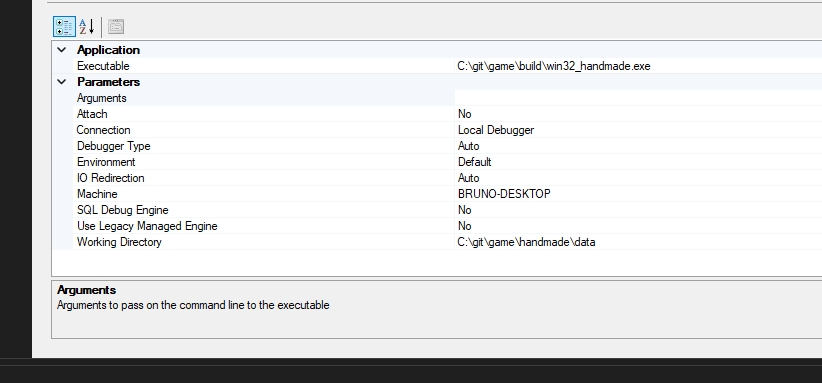

# game_from_scratch

## Resources

* https://hero.handmade.network/episode/code/day001/
* https://learn.microsoft.com/en-us/windows/win32/learnwin32/winmain--the-application-entry-point

## Build and Debug

* To build the application:

```
    cd handmade\code
    build.bat
```

* To debug the application:

```
    devenv ..\..\build\win32_handmade.exe
```

This will open visual studio, once there remember to change "Executable" and "Working Directory" on exe properties. Example:



Then just hit f11 and start debugging!

## Debugging Tools
* Press P Key to Pause
* Press L Key to start input loop and L key again to lock the loop
* Press Alt + Enter Keys to go full screen

## Troubleshoot

If when trying to build the application, you receive the error "The input line is too long. The syntax of the command is incorrect." make sure to put the project folder as close as possible to C: and if the error persists just restart your cmd.


## Doubts / Learn

* What is Device Independent Bitmap?
* What is raster function?
* Restudy memory in OS and memory allocation in C++
* understand arrow vs point https://www.geeksforgeeks.org/arrow-operator-in-c-c-with-examples/
* Understand pitch and stride https://learn.microsoft.com/pt-br/windows/win32/medfound/image-stride (tutorial 04)
* Chandler Carruth - C++ Compiler Optimization
* Search for XInput (controller api)
* DirectSound is deprecated and replaced by XAudio2
* Search C Runtime Library
* Estudar trigonometria
* the internal declaration on functions is made so that the compiler knows that there is no linkage, everything is compiled in one file
* What is CLANG?
* MMX, SSE and SSE2 Instrinsics
* Intel Intrinsics Guide https://www.intel.com/content/www/us/en/docs/intrinsics-guide/index.html
* Galois Dream: Gropup theory and differential equations:  https://archive.org/details/galoisdreamgroup0000kuga
* C++ Bit Operations
* Linear Blend https://youtu.be/S2fz4BS2J3Y?si=6gvYyRmn9Sakj2pw
* Raymond Chen - Expert on Windows Platform
* Agner Fog -> www.agner.org has an list of instruction latencies, throughputs and micro-operation breakdowns for Intel, AMD and VIA CPUs
* WolframAlpha
* Templates are bad for debugging so dont use them
* AABB - Axis Aligned Bounding Box
##Vectors
* Chris Hecker -> Indie Game famous developer, has articles etc
* Hadamard Product -> only for colors (we are also using it for chunk dim in meters)
* For moiton, we use Dot Product, Perp Dot Product and Cross Product
* Produto Interno
* For interpolation and Barycentric coordinates: https://caseymuratori.com/blog_0014
* Tip for debugging heap corruption bugs (engine way to allocate memory via arena): Tutorial 76 Q&A
* Collision Mesh
* Constructive Solid Geometry (deprecated) (Brushes) (Quake vs Unreal) -> Better than Polygon Soup (today) because is clearer
what is solid and what is not (Tutorial 79)
* John Carmack -> famous video game programmer
* rigid body dynamics
* Sparse Virtual Textures - Sean Barret https://www.youtube.com/watch?v=MejJL87yNgI&pp=ygUjc3BhcnNlIHZpcnR1YWwgdGV4dHVyZXMgc2VhbiBiYXJyZXQ%3D
* Sean Barret - Premultiplied Alpha
* LRU - Least Recently Used
* SSE vs AVX (For software renderer)
* Rasterization
* Shaders
* Very good blog, and must see the graphics pipeline -> https://fgiesen.wordpress.com/category/graphics-pipeline/
* Performance-Aware Programming Series https://www.computerenhance.com/i/99218768/performance-aware-programming-series
